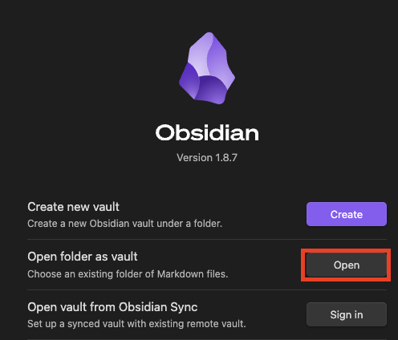

<h1 style="text-align:center;"> Obsidian for Academia Template </h1>

This repository serves as a demo for setting up an [Obsidian](https://obsidian.md) Vault for academics.

Obsidian is an incredibly powerful tool for note-taking on itself. Its capabilities can furthermore be significantly enhanced with a wide range of plugins from the Open Source Community. These plugins enable advanced functionalities, particularly in areas such as knowledge management, journaling, and literature reviews.

While Obsidian is straightforward to use with its default configuration, setting up plugins and integrations can be time-consuming. **This is why we propose here a default setup showcasing the Obsidian's capabilities for academic usage.**

# Features 

### **Zotero** Integration: 
[Zotero](https://www.zotero.org/) is a powerful tool to save academic papers. It can find and download open access pdfs, import relavant metadata, and allow you to read and highlight them.

### Literature management

- **Authors** Management:
- **Related Papers**:
# Installation
### Obsidian
- [ ] First, Download and install Obsidian, Unfortunately the last version has unfixed issues, so you can get a compatible one [here](https://github.com/obsidianmd/obsidian-releases/releases/tag/v1.7.6)
- [ ] To test this vault right away you can clone this repository:
```bash
git clone https://git.isir.upmc.fr/morand/obsidian-academia-template.git
```
- [ ] Then click "Open folder as Vault" and select the repository folder.



#### *Now than you are in Obsidian, you can open the [[❓Tutorial]]*
